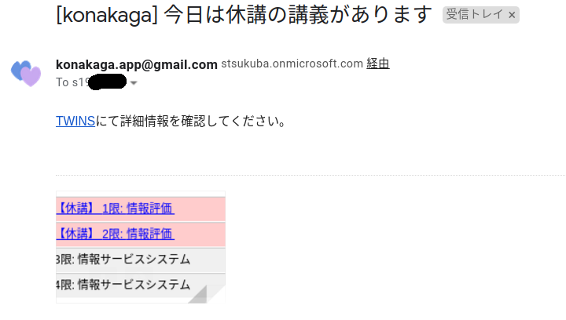
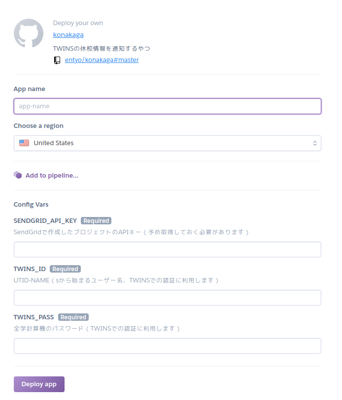
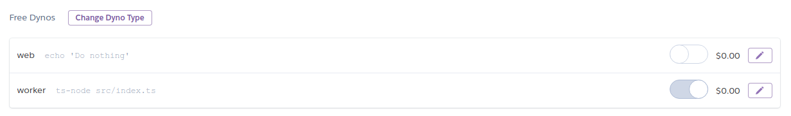

# konakaga

## これはなに？

毎朝 TWINS を見て、休講情報があると通知してくれるプログラムです。

Heroku App として各自でデプロイして使ってください。

## つかいかた

### 1. 連携サービスのアカウント作成

konakaga を使うためには、まず以下のサービスのアカウントを作成してください。

- [Heroku: Cloud Application Platform](https://www.heroku.com/)
  - konakaga をデプロイするために使います
- [SendGrid: Email Delivery Service](https://sendgrid.com/)
  - konakaga からメール通知をするために使います

また、以下の手順に従って、SendGrid で konakaga 用のプロジェクトを作成し API キーを発行してください。

> 1. SendGrid ダッシュボードの「API Keys」のページで Create API Key を選択
> 2. Create & View を選択

([API キーの管理 - ドキュメント | SendGrid](https://sendgrid.kke.co.jp/docs/User_Manual_JP/Settings/api_keys.html#-Create-an-API-Key)より)

### 2. アプリケーションのデプロイ

↑ このボタンを押すと、Heroku 上で次のような画面が表示されます

フォームを埋めて、`Deploy App` をクリックしてください。

デプロイが終了すると、`Manage App`というボタンが出てくるのでクリックしてください。

Dyno と呼ばれるリソースの設定を変更します。画像のように、`worker dyno` を ON, `web dyno` を OFF にしてください。

（この作業は自動化したいところですが、[ドキュメント](https://devcenter.heroku.com/articles/nodejs-support#default-web-process-type)を見る限り手動でやらざるを得ないと認識しています。いいやり方をご存じの方は教えてください…）

## 免責事項

- konakaga の不具合により休講情報を見逃しても開発者は一切責任を取りません
- konakaga はスクレイピングによって情報を収集しているので、ある日突然動かなくなることがありますが、その都度直すことは大変なので動作を保証しません
- konakaga の改変及び再配布を認めていますが、以下の点に注意してください
  - スクレイピングの頻度(短期間に大量のリクエストを発行しないでください)
  - 個人情報・認証情報の取り扱い
    - konakaga がプログラムを各自でデプロイする方式を取っているのは、TWINS のパスワード等の情報を運営者が管理しないようにするためです
